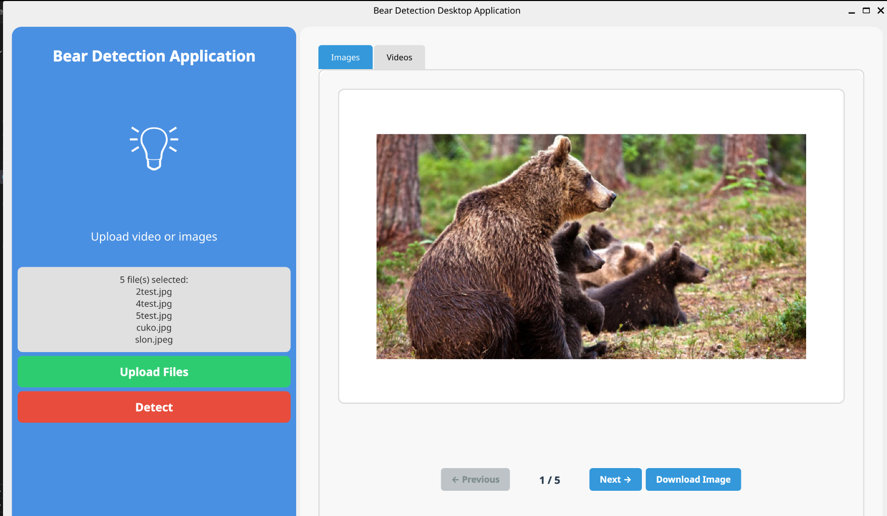
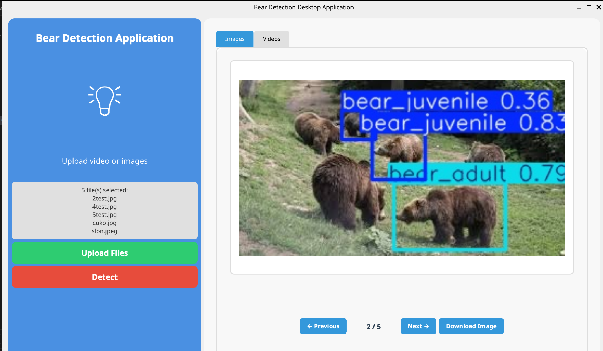
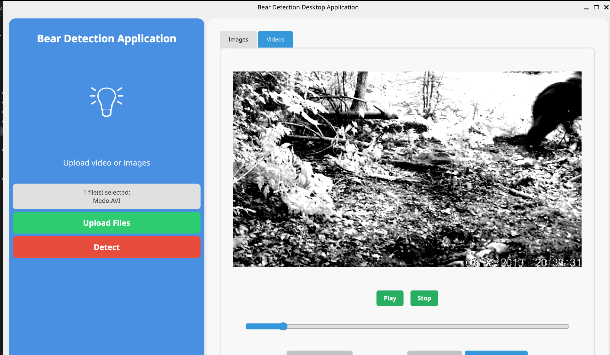

# Bear Detection Desktop Application

This desktop application enables detection of bears in images and videos using a YOLO-based model. It features a graphical user interface (GUI) and is simple to use. The model used for training is **YOLOv8**.

## Project Overview

The goal of this project is to assist in wildlife monitoring by detecting bears in their natural environment and classifying them into two categories:

* `bear_juvenile` (young bears)

* `bear_adult` (adult bears)

## Requirements

* **Python** (recommended 3.8 or newer)

* **pip** (Python package manager)

## Installation

1. **Clone the repository:**

   ```
   git clone https://github.com/aljaljak2/VI-projekat-Bear-Detection
   cd VI-projekat-Bear-Detection
   ```

2. **Install dependencies:**

   ```
   pip install -r requirements.txt
   ```

3. Ensure the YOLO model is located in the `trained_models` folder under the name `best.pt`.

## Running the Application

To launch the application, run:

```
python bear_detection_app.py
```

## Using the Application

1. Click on "Upload Files" and select the images or videos you want to analyze.

2. After uploading, click on "Detect" to start the detection process.

3. The results will be shown in the application. You can also download the results by clicking "Download Image" or "Download Video".

## Application Interface

### Main Window



### Image Detection Preview



### Video Detection Preview



## Model Performance

| Metric | Overall | bear_juvenile | bear_adult |
| ----- | ----- | ----- | ----- |
| mAP50-95 | 0.9833 | 0.9833 | 0.9833 |
| mAP50 | 0.9949 | 0.9950 | 0.9950 |
| Precision | 0.9940 | 0.9967 | 0.9917 |
| Recall | 0.9970 | 0.9984 | 0.9948 |
| Inference Speed | ~14 ms/image | - | - |

## Additional Resources

#### User Manual for the application is available at:

```
./documentation_presentation/Uputstvo za koristenje aplikacije
```

Google Colab Notebook (Model Training):
[Open Notebook](https://colab.research.google.com/drive/130Iv0U6pZT90PVD9jLfbN7uq2qLytOY7?usp=sharing)

Download Executable Files (Windows & iOS):
[Open Google Drive Folder](https://drive.google.com/drive/folders/1z51ybWAXDgY3U-mokuTW3FYfFhfiy6HW?usp=sharing)

Dataset Used for Training:
[Open Dataset Link](https://drive.google.com/file/d/1Sb1OV_uOKbHR6Nf826b2L4SPjGwLB8uo/view?usp=sharing)

## Notes

* All detection results are stored temporarily and can be downloaded directly from the application.

* If the YOLO model file (`best.pt`) is not present, you must train it or download a compatible model and place it in the `trained_models` folder.

## Contact

For additional questions or support, feel free to contact the project authors.
