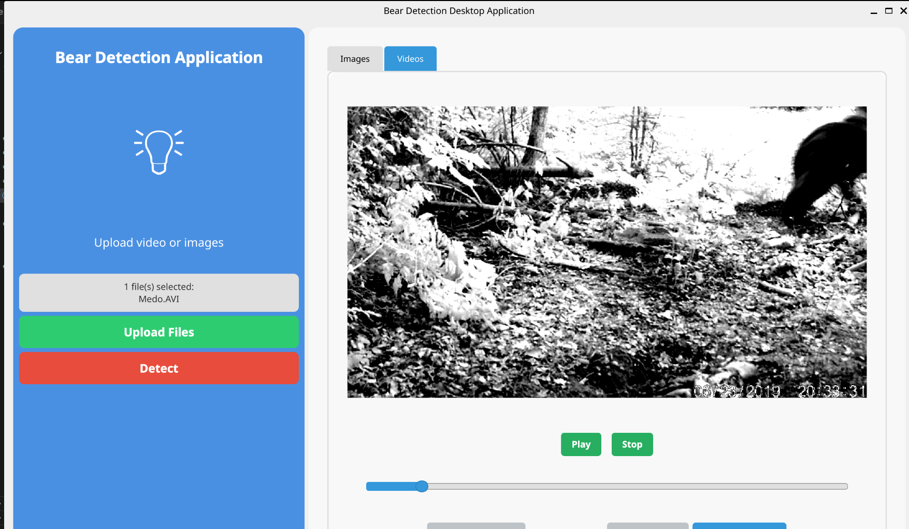

# Bear Detection Desktop Aplikacija

Ova aplikacija omogućava detekciju medvjeda na slikama i video zapisima koristeći YOLO model. Aplikacija ima grafički interfejs (GUI) i jednostavna je za korištenje.

## Zahtjevi

- **Python** (preporučeno 3.8 ili noviji)
- **pip** (Python package manager)

## Instalacija

1. **Klonirajte repozitorij:**
   ```bash
   git clone <URL_DO_REPOZITORIJA>
   cd VI-projekat-Bear-Detection
   ```

2. **Instalirajte zavisnosti:**
   ```bash
   pip install -r requirements.txt
   ```

3. **Provjerite da se YOLO model nalazi u folderu `trenirani modeli` pod nazivom `best.pt`.**

## Pokretanje aplikacije

Pokrenite aplikaciju sljedećom komandom:
```bash
python bear_detection_app.py
```

## Korištenje aplikacije

1. Kliknite na **"Upload Files"** i izaberite slike ili video zapise koje želite analizirati.
2. Nakon što su fajlovi učitani, kliknite na **"Detect"** da pokrenete detekciju.
3. Rezultati će biti prikazani u aplikaciji, a možete ih i preuzeti klikom na **"Download Image"** ili **"Download Video"**.

## Izgled aplikacije

### Glavni prozor


### Prikaz slike sa detekcijom


### Prikaz video zapisa sa detekcijom



> **Napomena:** Ako slike nisu prikazane, kreirajte folder `docs/screenshots` i dodajte vlastite slike ekrana aplikacije.

## Napomene

- Svi rezultati detekcije se privremeno čuvaju i mogu se preuzeti direktno iz aplikacije.
- Ako nemate YOLO model (`best.pt`), potrebno ga je trenirati ili preuzeti odgovarajući model i smjestiti u folder `trenirani modeli`.

## Kontakt

Za dodatna pitanja ili probleme, kontaktirajte autora projekta.